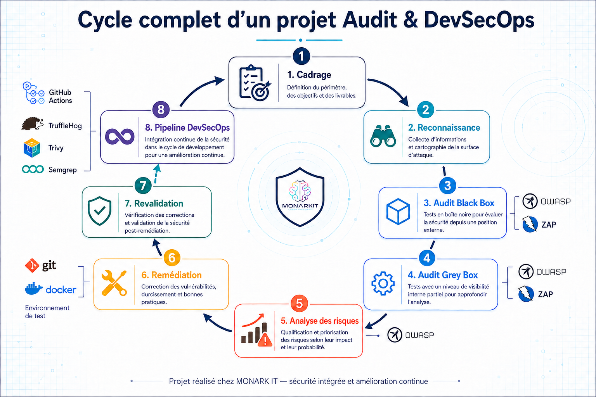
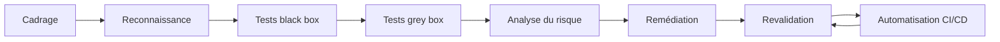

# Audit de sécurité et démarche DevSecOps

> Étude de cas anonymisée — stage de cybersécurité de deux mois chez MONARK IT

## Présentation

Ce dépôt documente une mission de sécurisation menée chez **MONARK IT** sur une
application web interne. Il présente la méthode suivie, les choix techniques,
les contrôles automatisés et les compétences mobilisées, sans divulguer le
code source, les données, l'architecture détaillée ou l'identité du produit
concerné.

La mission a suivi un cycle complet : cadrage, audit, analyse des risques,
remédiation, revalidation et intégration de contrôles de sécurité dans une
pipeline CI/CD.

## Objectifs

- cartographier une surface d'attaque autorisée ;
- évaluer les contrôles d'authentification et d'autorisation ;
- analyser les risques applicatifs et les dépendances ;
- proposer et vérifier des remédiations ;
- automatiser les tests de non-régression ;
- améliorer la traçabilité des validations de sécurité.

## Démarche générale

## Contrôles intégrés

| Couche | Objectif | Exemple d'outil |
|---|---|---|
| Secrets | Détecter les identifiants accidentellement versionnés | TruffleHog |
| Dépendances | Identifier les composants vulnérables | Trivy |
| Code source | Détecter des motifs de code à risque | Semgrep |
| Application | Vérifier le comportement de sécurité | DAST métier |
| Surface HTTP | Compléter les tests dynamiques génériques | OWASP ZAP |

## Scénarios de sécurité étudiés

Les cas présentés sont volontairement généralisés :

- contrôle d'accès au niveau objet ;
- séparation des privilèges et protection des rôles ;
- minimisation des données retournées par une API ;
- limitation des tentatives d'authentification ;
- réduction de la surface de services exposés ;
- validation des fichiers téléversés ;
- suivi de la dette de dépendances ;
- distinction entre échec de sécurité, avertissement et erreur d'exécution.

## Résultats génériques

- conversion de scénarios manuels en tests négatifs reproductibles ;
- contrôles complémentaires sur les secrets, dépendances, code et API ;
- amélioration progressive de la stabilité de la pipeline ;
- séparation claire entre `PASS`, `FAIL`, `WARN`, `SKIP` et erreur technique ;
- traçabilité entre constat, correction, validation et contrôle continu ;
- documentation des limites et des risques résiduels.

Ces résultats décrivent la démarche réalisée. Ils ne constituent ni une
certification de sécurité ni une affirmation d'absence de vulnérabilité.

## Documentation

1. [Contexte et cadrage](docs/01_contexte_et_cadrage.md)
2. [Méthodologie d'audit](docs/02_methodologie_audit.md)
3. [Analyse et traitement des risques](docs/03_analyse_et_remediation.md)
4. [Pipeline DevSecOps](docs/04_pipeline_devsecops.md)
5. [Validation et qualité des résultats](docs/05_validation_des_resultats.md)
6. [Compétences et retour d'expérience](docs/06_competences_et_retour.md)

## Confidentialité

La mention de MONARK IT sert uniquement à identifier l'organisme d'accueil.
Cette documentation ne contient volontairement aucun extrait du dépôt privé,
commit, branche, pull request, domaine, endpoint, identifiant, capture interne
ou détail d'infrastructure. Voir [CONFIDENTIALITY.md](CONFIDENTIALITY.md).

## Auteur

**Bouanani Noussair**  
Élève ingénieur en Génie Cyber Défense et Systèmes de Télécommunications
Embarqués. Stage de fin d'année réalisé chez MONARK IT à Marrakech.

## Marques

Les noms et logos des outils cités appartiennent à leurs propriétaires
respectifs. Leur présence est uniquement descriptive et n'implique aucune
affiliation ou approbation.
