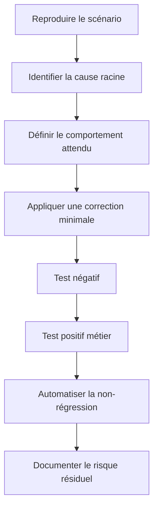

# Analyse et traitement des risques

## Approche de priorisation

La priorité de traitement a combiné quatre dimensions : impact métier,
facilité d'exploitation, privilèges nécessaires et niveau de confiance dans la
preuve. Cette lecture complète l'usage d'un score technique.

## Catégories traitées

### Autorisation au niveau objet

Les décisions d'accès doivent être appliquées côté serveur pour chaque objet et
chaque action. Le masquage d'un bouton ou le filtrage dans le client ne
constitue pas un contrôle de sécurité suffisant.

### Gestion des privilèges

Les champs sensibles ne doivent pas être modifiables par les opérations
destinées aux utilisateurs ordinaires. Les changements de rôle nécessitent une
opération dédiée, une autorisation explicite et une journalisation adaptée.

### Minimisation des réponses

Une API doit retourner uniquement les informations nécessaires au cas d'usage.
Les collections globales et objets contenant des données personnelles doivent
être filtrés selon le rôle, le contexte et la relation avec la ressource.

### Défense contre l'automatisation abusive

La limitation de débit doit tenir compte de l'architecture cible. Un compteur
local peut convenir à une démonstration, mais une architecture distribuée exige
un stockage partagé et une gestion correcte des proxies.

### Réduction de surface

Un composant d'administration ou de diagnostic ne devrait pas être exposé
publiquement par défaut. La meilleure remédiation consiste souvent à retirer
la surface inutile plutôt qu'à ajouter uniquement une authentification.

### Téléversement de fichiers

Le contrôle combine extension autorisée, type MIME, cohérence du contenu,
neutralisation du nom et stockage dans un emplacement non exécutable.

### Dépendances

La mise à niveau réduit le risque à un instant donné, mais la publication
continue de nouvelles vulnérabilités impose une surveillance récurrente.

## Cycle de remédiation

