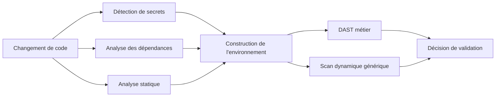

# Pipeline DevSecOps

## Objectif

La pipeline regroupe des contrôles complémentaires. Aucun outil unique ne peut
couvrir les secrets, les dépendances, le code et le comportement réel de
l'application.

## Détection de secrets

La recherche porte sur les ajouts et l'historique pertinents. Un résultat doit
être interprété selon sa validité et son contexte, puis conduire à une rotation
si un secret réel a été exposé.

## Analyse des dépendances

L'analyse des manifestes et fichiers de verrouillage permet d'identifier les
composants vulnérables. Les règles de blocage doivent distinguer les
dépendances de production des outils de développement et documenter les
exceptions.

## Analyse statique

La pertinence d'un scan dépend des règles sélectionnées et du nombre réel de
fichiers analysés. Un job vert qui ne cible pas la technologie du projet est un
faux sentiment de sécurité.

## DAST métier

Un script métier vérifie les exigences issues de l'audit : codes HTTP,
propriétés des réponses et maintien de l'état de la ressource. Les scénarios
utilisent plusieurs identités de test lorsque la propriété ou le rôle est en
jeu.

## Scan dynamique générique

Le scan générique complète les tests métier à partir d'une spécification de
l'API. Ses avertissements sont conservés pour analyse et ne sont rendus
bloquants qu'après triage.

## Robustesse opérationnelle

La stabilisation d'une pipeline de sécurité nécessite également :

- des attentes explicites pour les bases de données et services ;
- une gestion sûre des clés et variables au runtime ;
- des diagnostics utiles en cas d'échec ;
- des timeouts bornés ;
- la distinction entre échec de test et échec d'infrastructure ;
- la conservation contrôlée des rapports comme artefacts.

